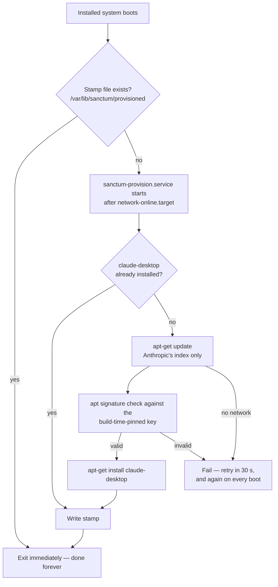

# Sanctum OS architecture

How the pieces fit — from the constraint chain that dictated every major
decision, through the boot path, to what actually happens on first boot.

## The constraint chain

Sanctum's shape is not aesthetic preference; it is the closure of four hard
constraints:

1. **The host is an Apple Silicon Mac.** That is the machine serious local AI
   work happens on, and the isolation boundary we want is a VM.
2. **VirtualBox on Apple Silicon virtualizes ARM64 guests only.** There is no
   x86 emulation in VirtualBox 7.2's macOS/ARM build. So the guest **must** be
   aarch64 — and it must boot UEFI, because ARM64 VMs have no BIOS.
3. **Claude Desktop's official Linux build is a Debian package for arm64**,
   published in Anthropic's own signed apt repository. Wanting the official,
   signed, auto-updatable build — not a repack — means the guest must be a
   Debian-family arm64 system with apt.
4. **Debian 13 (trixie)** is the current Debian stable: GNOME 48, a maintained
   live-build toolchain, Calamares with Debian settings, arm64 as a
   first-class architecture, and a security team behind every package. A
   derivative inherits all of it — including the update stream — for free.

Given those four, the remaining choices follow: **live-build** because it is
Debian's native ISO factory (configuration is text in `config/`, reproducible
in CI); **Calamares** because it is the standard live-installer with LUKS
support and Debian integration; **Flatpak** for end-user apps because Firefox
and Telegram ship current aarch64 builds on Flathub inside bubblewrap
sandboxes, decoupling app freshness from the stable base — and sandboxing is
the application-security model (see [SECURITY.md](SECURITY.md)).

## Boot chain

```
VirtualBox ARM64 VM (UEFI firmware — there is no BIOS path)
  └─ EFI/BOOT/BOOTAA64.EFI            GRUB for arm64, from the ISO's ESP
      └─ GRUB (hidden, 2 s)           branded; hardened cmdline from
                                      /etc/default/grub.d/10-sanctum.cfg
          └─ Linux arm64 + initramfs
              ├─ live:      live-boot locates the squashfs on the ISO,
              │             assembles / as squashfs + tmpfs overlay
              ├─ installed: cryptsetup prompts for the LUKS passphrase,
              │             opens the root container
              └─ Plymouth   "sanctum" splash theme (and the LUKS prompt)
                  └─ systemd → graphical.target
                      └─ GDM → GNOME 48 (Wayland)
```

The ISO is built `iso-hybrid` with GRUB-EFI and `--uefi-secure-boot auto`
(`auto/config`); the installed system carries the full signed arm64
chain (`shim-signed`, `grub-efi-arm64-signed`) so it also boots firmware that
enforces Secure Boot. VirtualBox's ARM firmware does not enforce it by default.

## Live vs. installed

One image, two lives. Differences at a glance:

| | Live session | Installed system |
| --- | --- | --- |
| Root filesystem | Read-only squashfs + RAM overlay; nothing persists | ext4 inside a LUKS container |
| Disk encryption | None (nothing is written) | LUKS full-disk, passphrase at boot |
| User | `sanctum`, auto-login, passwordless sudo | Your account from the installer; root locked; sudo with password |
| Journald | RAM-bounded (32 MB runtime) | Persistent but capped (64 MB), flipped by Calamares postinstall |
| Claude Desktop | Absent (would not persist anyway) | Provisioned on first boot with network |
| Purpose | Try it; run the installer | The workspace |

Everything else — firewall, DNS, sysctls, module blacklist, Flatpaks and their
overrides, update timers — is baked into the squashfs, so the installed system
starts hardened rather than becoming hardened.

## First-boot provisioning

Anthropic's terms don't permit redistributing Claude Desktop in the ISO, so the
image carries only two things: the apt source
(`/etc/apt/sources.list.d/claude-desktop.list`, constrained to `arch=arm64`
and `signed-by`) and Anthropic's public key, whose fingerprint was pinned and
verified when the image was built. The install happens on the machine it will
live on:



Properties worth noting: the unit is idempotent (stamp file + `dpkg -s` check),
self-healing (`Restart=on-failure`, re-runs each boot until success), sandboxed
for what it is (`PrivateTmp`, `ProtectHome`, `DevicePolicy=closed` — it runs
apt, so it cannot be fully confined), and it refreshes *only* Anthropic's
package index, leaving Debian's lists to unattended-upgrades' schedule. After
provisioning, Claude Desktop updates flow through the same unattended-upgrades
mechanism as the rest of the OS (`site=downloads.claude.ai` is an allowed
origin).

## Ongoing maintenance loops

Three loops keep an installed system current with no user action:

- **unattended-upgrades** (daily, apt): Debian security, stable updates, and
  Claude Desktop. No automatic reboots.
- **sanctum-flatpak-update.timer** (daily, 10 min after boot, randomized):
  Firefox and Telegram from Flathub.
- **systemd-timesyncd**: sane clocks, which both TLS and DNSSEC quietly
  require.

There is no software center in the image (`gnome-software` is purged at build
time) — updates are an invariant, not an app.

## Where things live in the repo

| Concern | Path |
| ------- | ---- |
| Image definition (arch, bootloader, squashfs, live params) | `auto/config` |
| Package selection | `config/package-lists/*.list.chroot` |
| Files shipped verbatim into `/` | `config/includes.chroot/` |
| Build-time customization (identity, key pinning, Flatpaks, services, hardening, cleanup) | `config/hooks/normal/*.hook.chroot` |
| Brand sources (SVG) + raster manifest | `branding/` |
| Desktop defaults (wallpaper, favorites, light theme, fonts) | `config/includes.chroot/etc/dconf/` (compiled by hook `0500`) |
| Installer branding and LUKS-default configuration | `config/includes.chroot/` under Calamares' paths (branding at `/usr/share/calamares/branding/sanctum`) |
| Build entry points | `build/*.sh`, `.github/workflows/build-iso.yml` |
